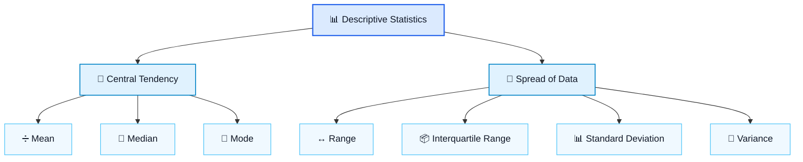

# 📊 Descriptive Statistics Notes

Descriptive statistics are methods used to **summarize, organize, and describe data**.

They help us understand:

* 🎯 The centre of the data
* 📏 How spread out the data are
* 🔁 Which values appear most often
* 📦 How the data are distributed



---

# 🎯 Central Tendency

Measures of central tendency describe the **centre or typical value** of a dataset.

The three main measures are:

1. Mean
2. Median
3. Mode

---

## ➗ Mean

### Definition

The **mean** is the average of all values in a dataset.

To calculate the mean:

1. Add all the values.
2. Divide the total by the number of values.

### Formula

```text
Mean = Sum of all values ÷ Number of values
```

### Example

Consider the dataset:

```text
4, 6, 8, 10
```

Add the values:

```text
4 + 6 + 8 + 10 = 28
```

There are four values:

```text
Mean = 28 ÷ 4 = 7
```

✅ **Mean = 7**

### Important point

The mean is affected by extremely large or extremely small values, called **outliers**.

---

## 📍 Median

### Definition

The **median** is the middle value when the data are arranged from smallest to largest.

### Example with an odd number of values

```text
3, 5, 7, 9, 11
```

The middle value is:

```text
7
```

✅ **Median = 7**

### Example with an even number of values

```text
4, 6, 8, 10
```

The two middle values are:

```text
6 and 8
```

Find their mean:

```text
Median = (6 + 8) ÷ 2
Median = 7
```

✅ **Median = 7**

### Important point

The median is less affected by outliers than the mean.

---

## 🔁 Mode

### Definition

The **mode** is the value that appears most frequently in a dataset.

### Example

```text
2, 3, 3, 4, 5
```

The number `3` appears twice, while the other numbers appear once.

✅ **Mode = 3**

### More than one mode

A dataset can have:

* One mode
* More than one mode
* No mode

### Example with two modes

```text
2, 2, 4, 4, 6
```

Both `2` and `4` appear twice.

✅ **Modes = 2 and 4**

This is called a **bimodal dataset**.

### Example with no mode

```text
1, 2, 3, 4, 5
```

Every value appears only once.

✅ **There is no mode**

---

# ⚖️ Mean vs Median

The mean and median both describe the centre of the data, but they behave differently when outliers are present.

## Example without an outlier

```text
20, 22, 24, 26, 28
```

### Mean

```text
Mean = (20 + 22 + 24 + 26 + 28) ÷ 5
Mean = 24
```

### Median

```text
Median = 24
```

✅ Mean and median are both `24`.

---

## Example with an outlier

```text
20, 22, 24, 26, 100
```

### Mean

```text
Mean = (20 + 22 + 24 + 26 + 100) ÷ 5
Mean = 38.4
```

### Median

```text
Median = 24
```

The unusually large value `100` pulls the mean upward.

### When should each one be used?

| Measure | Best used when                                |
| ------- | --------------------------------------------- |
| Mean    | Data are balanced and have no strong outliers |
| Median  | Data are skewed or contain strong outliers    |

### Example

For salaries:

```text
₹30,000, ₹32,000, ₹35,000, ₹38,000, ₹5,00,000
```

The mean salary will be pulled upward by the very high salary.

The median gives a better idea of what a typical worker earns.

---

# 📏 Spread of Data

Measures of spread describe how far apart the values are.

Two datasets can have the same mean but very different levels of variation.

### Example

Dataset A:

```text
8, 8, 8, 8, 8
```

Dataset B:

```text
2, 6, 8, 10, 14
```

Both datasets have:

```text
Mean = 8
```

However:

* Dataset A has no spread.
* Dataset B is much more spread out.

Common measures of spread include:

* Range
* Interquartile range
* Variance
* Standard deviation

---

## ↔️ Range

### Definition

The **range** is the difference between the largest and smallest values.

### Formula

```text
Range = Maximum value − Minimum value
```

### Example

```text
3, 5, 8, 10, 15
```

Maximum value:

```text
15
```

Minimum value:

```text
3
```

Therefore:

```text
Range = 15 − 3
Range = 12
```

✅ **Range = 12**

### Limitation

The range only uses two values:

* The minimum
* The maximum

Therefore, it can be strongly affected by outliers.

---

## 📦 Interquartile Range

### Definition

The **interquartile range**, or **IQR**, measures the spread of the middle 50% of the data.

It is calculated using:

* `Q1`: First quartile
* `Q3`: Third quartile

### Formula

```text
IQR = Q3 − Q1
```

### Example

Consider the ordered dataset:

```text
1, 2, 3, 4, 5, 6, 7, 8
```

The lower half is:

```text
1, 2, 3, 4
```

Therefore:

```text
Q1 = (2 + 3) ÷ 2
Q1 = 2.5
```

The upper half is:

```text
5, 6, 7, 8
```

Therefore:

```text
Q3 = (6 + 7) ÷ 2
Q3 = 6.5
```

Now calculate the IQR:

```text
IQR = 6.5 − 2.5
IQR = 4
```

✅ **IQR = 4**

### Why is IQR useful?

The IQR is less affected by extreme values because it focuses only on the middle 50% of the dataset.

---

# 📐 Variance

## What is Variance?

Variance measures how far the data values are spread from the mean.

It calculates the average of the **squared differences** between each value and the mean.

### Simple idea

* Small variance → values are close to the mean
* Large variance → values are far from the mean

### Why are the differences squared?

Suppose the mean is `7`.

A value of `4` has a deviation of:

```text
4 − 7 = −3
```

A value of `10` has a deviation of:

```text
10 − 7 = 3
```

If we add the deviations:

```text
−3 + 3 = 0
```

The positive and negative values cancel each other.

To prevent this, the deviations are squared:

```text
(−3)² = 9
3² = 9
```

Now both distances contribute positively.

---

## Variance Example

Consider the dataset:

```text
4, 6, 8, 10
```

### Step 1: Calculate the mean

```text
Mean = (4 + 6 + 8 + 10) ÷ 4
Mean = 7
```

### Step 2: Calculate each deviation from the mean

| Value | Value − Mean |
| ----: | -----------: |
|     4 |           -3 |
|     6 |           -1 |
|     8 |            1 |
|    10 |            3 |

### Step 3: Square each deviation

| Value | Deviation | Squared deviation |
| ----: | --------: | ----------------: |
|     4 |        -3 |                 9 |
|     6 |        -1 |                 1 |
|     8 |         1 |                 1 |
|    10 |         3 |                 9 |

### Step 4: Find the average of the squared deviations

```text
Variance = (9 + 1 + 1 + 9) ÷ 4
Variance = 20 ÷ 4
Variance = 5
```

✅ **Population variance = 5**

### Important point

Variance is expressed in squared units.

For example:

* Height measured in centimetres
* Variance measured in square centimetres

This makes variance harder to interpret directly.

Standard deviation solves this problem.

---

# 📊 Standard Deviation

## 🔹 What is Standard Deviation?

Standard deviation measures how spread out the data are around the mean.

It is the square root of the variance.

### Formula

```text
Standard Deviation = √Variance
```

### Interpretation

* Small SD → data points are close to the mean
* Large SD → data points are widely spread from the mean
* SD of zero → every value is exactly the same

Standard deviation is one of the most common ways to describe variability in data.

---

# 🧮 Standard Deviation: Step-by-Step Example

Consider the dataset:

```text
4, 6, 8, 10
```

## Step 1: Calculate the mean

```text
Mean = (4 + 6 + 8 + 10) ÷ 4
Mean = 7
```

## Step 2: Subtract the mean from each value

| Value | Value − Mean |
| ----: | -----------: |
|     4 |           -3 |
|     6 |           -1 |
|     8 |            1 |
|    10 |            3 |

## Step 3: Square each difference

| Value | Deviation | Squared deviation |
| ----: | --------: | ----------------: |
|     4 |        -3 |                 9 |
|     6 |        -1 |                 1 |
|     8 |         1 |                 1 |
|    10 |         3 |                 9 |

## Step 4: Calculate the variance

```text
Variance = (9 + 1 + 1 + 9) ÷ 4
Variance = 5
```

## Step 5: Take the square root

```text
Standard deviation = √5
Standard deviation ≈ 2.24
```

✅ **Population standard deviation ≈ 2.24**

This means the values are typically about `2.24` units away from the mean.

---

# 🎯 Dartboard Analogy

Think of the mean as the centre of a dartboard.

The standard deviation tells us how far the darts usually land from the centre.

### Small standard deviation

```text
       🎯
     ✖ ✖ ✖
      ✖ ✖
```

The darts are tightly clustered near the centre.

### Large standard deviation

```text
✖               ✖

         🎯

    ✖                   ✖
```

The darts are scattered far from the centre.

Therefore:

* 🎯 Mean = centre of the dartboard
* 📏 Standard deviation = typical distance from the centre

---

# 🔬 Why Standard Deviation Is Useful

## 1. It describes the spread around the mean

Suppose the mean height of a group is:

```text
Mean = 173 cm
SD = 8.8 cm
```

The SD tells us that the heights commonly differ from the mean by approximately `8.8 cm`.

However, SD should not always be interpreted as the exact average distance from the mean. It is a measure based on squared distances.

---

## 2. It helps compare consistency

Consider two machines producing metal parts.

### Machine A

```text
10.0, 10.1, 9.9, 10.0, 10.1
```

The measurements are close together.

✅ Small SD
✅ More consistent production

### Machine B

```text
8.0, 9.0, 10.0, 11.0, 12.0
```

The measurements are more spread out.

❌ Large SD
❌ Less consistent production

---

## 3. It helps estimate common ranges

For data that follow an approximately normal, bell-shaped distribution:

| Distance from the mean | Approximate percentage of data |
| ---------------------- | -----------------------------: |
| Within 1 SD            |                            68% |
| Within 2 SDs           |                            95% |
| Within 3 SDs           |                          99.7% |

This is called the **68–95–99.7 rule**.

### Example

Suppose:

```text
Mean height = 173 cm
SD = 8.8 cm
```

### Within 1 SD

```text
Lower value = 173 − 8.8 = 164.2 cm
Upper value = 173 + 8.8 = 181.8 cm
```

Approximately 68% of values may fall between:

```text
164.2 cm and 181.8 cm
```

### Within 2 SDs

```text
173 ± (2 × 8.8)
173 ± 17.6
```

Approximately 95% of values may fall between:

```text
155.4 cm and 190.6 cm
```

> ⚠️ This rule should only be used when the data are approximately normally distributed.

---

# 💊 Why Scientists Care About Standard Deviation

Suppose scientists are testing two medicines.

## Medicine A

```text
Average improvement = 10%
```

Almost everyone improves by around 10%.

✅ Small standard deviation
✅ Results are consistent
✅ The medicine behaves predictably

## Medicine B

```text
Average improvement = 10%
```

However:

* Some people improve by 50%.
* Some people show no improvement.
* Some people become worse.

❌ Large standard deviation
❌ Results are inconsistent
❌ The average alone hides important information

Both medicines can have the same mean improvement, but the standard deviation reveals that their results are very different.

---

# ⚖️ Variance vs Standard Deviation

| Feature        | Variance                               | Standard deviation             |
| -------------- | -------------------------------------- | ------------------------------ |
| Meaning        | Average squared distance from the mean | Typical spread around the mean |
| Calculation    | Average of squared deviations          | Square root of variance        |
| Units          | Squared units                          | Original units                 |
| Interpretation | Less intuitive                         | Easier to understand           |
| Example unit   | cm²                                    | cm                             |

### Example

```text
Variance = 25 cm²
```

Therefore:

```text
Standard deviation = √25
Standard deviation = 5 cm
```

The standard deviation is easier to understand because it uses the same unit as the original data.

---

# 🧠 Quick Summary

| Measure            | Meaning                                      |
| ------------------ | -------------------------------------------- |
| Mean               | Average value                                |
| Median             | Middle value                                 |
| Mode               | Most frequent value                          |
| Range              | Maximum minus minimum                        |
| IQR                | Spread of the middle 50%                     |
| Variance           | Average squared distance from the mean       |
| Standard deviation | Spread around the mean in the original units |

---

# ✅ Easy Memory Tricks

* ➗ **Mean** = Add and divide
* 📍 **Median** = Middle
* 🔁 **Mode** = Most common
* ↔️ **Range** = Largest minus smallest
* 📦 **IQR** = Middle 50%
* 📐 **Variance** = Squared spread
* 📊 **Standard deviation** = Understandable spread

---

# 📝 Final Example

Consider two datasets:

```text
Dataset A: 8, 8, 8, 8, 8
Dataset B: 2, 6, 8, 10, 14
```

Both have:

```text
Mean = 8
```

But:

```text
Dataset A:
Range = 0
Variance = 0
SD = 0
```

```text
Dataset B:
Range = 12
Variance = 16
SD = 4
```

Therefore:

* Dataset A has no variation.
* Dataset B has much greater variation.
* The mean alone cannot describe the entire dataset.
* Measures of spread provide the missing information.
