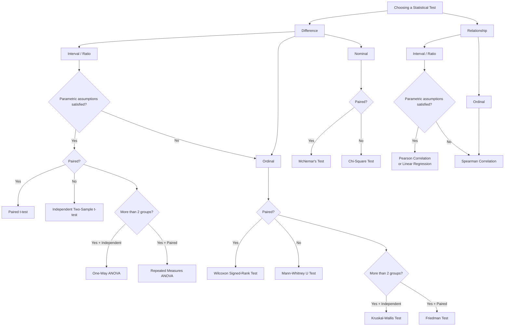

# 📊 Choosing a Statistical Test

```mermaid
flowchart TD

    A["Choosing a Statistical Test"]

    A --> B["Difference"]
    A --> C["Relationship"]

%% ---------------- DIFFERENCE ----------------

    B --> D["Interval / Ratio"]
    B --> E["Ordinal"]
    B --> F["Nominal"]

%% Interval/Ratio

    D --> G{"Parametric assumptions satisfied?"}

    G -->|Yes| H{"Paired?"}
    G -->|No| E

    H -->|Yes| I["Paired t-test"]
    H -->|No| J["Independent Two-Sample t-test"]

%% Ordinal

    E --> K{"Paired?"}

    K -->|Yes| L["Wilcoxon Signed-Rank Test"]
    K -->|No| M["Mann-Whitney U Test"]

%% Nominal

    F --> N{"Paired?"}

    N -->|Yes| O["McNemar's Test"]
    N -->|No| P["Chi-Square Test"]

%% More than 2 samples

    H --> Q{"More than 2 groups?"}

    Q -->|Yes + Independent| R["One-Way ANOVA"]
    Q -->|Yes + Paired| S["Repeated Measures ANOVA"]

    K --> T{"More than 2 groups?"}

    T -->|Yes + Independent| U["Kruskal-Wallis Test"]
    T -->|Yes + Paired| V["Friedman Test"]

%% ---------------- RELATIONSHIP ----------------

    C --> W["Interval / Ratio"]
    C --> X["Ordinal"]

%% Relationship Interval

    W --> Y{"Parametric assumptions satisfied?"}

    Y -->|Yes| Z["Pearson Correlation<br/>or Linear Regression"]

    Y -->|No| AA["Spearman Correlation"]

%% Relationship Ordinal

    X --> AA
```
