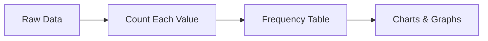
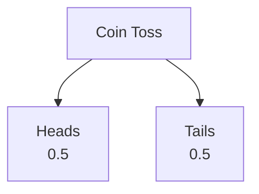
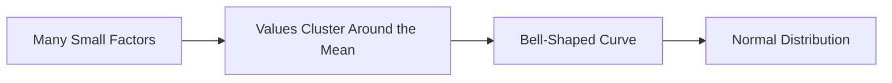
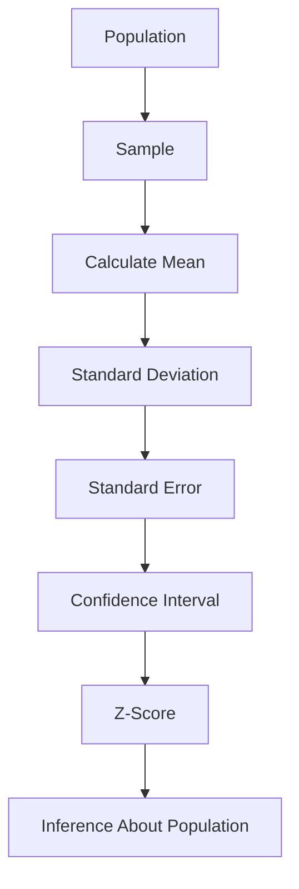

# 📊 Chapter 1: Frequency Distribution

A **Frequency Distribution** shows **how many times each value appears** in a dataset.

Instead of looking at a long list of numbers, we organize the data into a table to make patterns easier to see.

---

## 🎯 Why Use a Frequency Distribution?

It helps us:

- 📋 Summarize large amounts of data
- 🔍 Identify patterns and trends
- 📊 Create graphs (histograms, bar charts, pie charts)
- ⚠️ Spot unusual or extreme values (outliers)

---

## 🐟 Example

Suppose 10 people caught the following number of fish:

```text
2, 3, 3, 5, 2, 4, 3, 5, 2, 4
```

### Frequency Table

| Number of Fish | Frequency |
|---------------:|----------:|
| 2 | 3 |
| 3 | 3 |
| 4 | 2 |
| 5 | 2 |

---

## 💡 Interpretation

- 🎣 2 fish were caught **3 times**
- 🎣 3 fish were caught **3 times**
- 🎣 4 fish were caught **2 times**
- 🎣 5 fish were caught **2 times**

---

## 📈 Visual Representation

### Bar Chart

```text
Frequency

3 | ███  ███
2 | ███  ███  ██  ██
1 |
0 +-------------------------
     2    3    4    5
```

Each block (█) represents one observation.

---

## 🔄 How a Frequency Distribution is Created



---

## 📚 Where Is It Used?

- Survey results
- Exam scores
- Number of customers
- Heights and weights
- Medical research
- Sales data

---

## 🧠 Memory Trick

```text
Frequency = Count

Frequency Distribution
=
"How many times did each value occur?"
```

---

## ✅ Key Takeaways

- Frequency Distribution counts how often each value appears.
- It summarizes raw data into an easy-to-read table.
- It helps identify patterns and trends.
- It is the foundation for many statistical graphs.

---
---

# 🎲 Chapter 2: Probability Distribution

A **Probability Distribution** tells us **how likely each possible outcome is**.

Unlike a **Frequency Distribution**, which uses **observed data**, a Probability Distribution describes the **entire population or all possible outcomes**.

---

# 🎯 Frequency vs Probability

| Frequency Distribution | Probability Distribution |
|------------------------|--------------------------|
| Based on observed data (sample) | Based on all possible outcomes (population) |
| Counts how often values occur | Gives the probability of each value |
| Frequencies may add up to any sample size | Probabilities always add up to **1 (100%)** |

---

# 🪙 Example 1: Tossing a Fair Coin

Possible outcomes:

```text
Heads
Tails
```

### Probability Distribution

| Outcome | Probability |
|---------|------------:|
| Heads | 0.5 |
| Tails | 0.5 |

Total probability:

```text
0.5 + 0.5 = 1
```

✅ Every outcome is equally likely.

---

## 📊 Probability Tree



---

# 🎲 Example 2: Rolling a Fair Die

Possible outcomes:

```text
1, 2, 3, 4, 5, 6
```

### Probability Distribution

| Value | Probability |
|------:|------------:|
| 1 | 1/6 |
| 2 | 1/6 |
| 3 | 1/6 |
| 4 | 1/6 |
| 5 | 1/6 |
| 6 | 1/6 |

Since the die is fair,

```text
Each outcome is equally likely.
```

Total probability:

```text
6 × (1/6) = 1
```

---

# 📈 Visual Representation

```text
Probability

1/6 | ██ ██ ██ ██ ██ ██

0   +--------------------------
      1  2  3  4  5  6
```

Each bar has the same height because every outcome has the same probability.

---

# 🔄 How a Probability Distribution Works


---

# 💡 Why Is It Useful?

Probability distributions help us:

- 🎯 Predict future outcomes
- 📊 Calculate averages and probabilities
- 📈 Build statistical models
- 🔬 Perform hypothesis testing
- 📐 Construct confidence intervals

---

# 🧠 Easy Memory Trick

```text
Frequency
↓

What DID happen?

Probability
↓

What COULD happen?
```

---

# 📚 Real-Life Examples

| Situation | Probability Distribution |
|-----------|-------------------------|
| Coin toss | Heads or Tails |
| Rolling a die | Numbers 1–6 |
| Lottery | Chance of each number |
| Weather | Probability of rain |
| Genetics | Probability of inherited traits |

---

# ✅ Key Takeaways

- Frequency Distribution describes **observed data**.
- Probability Distribution describes **possible outcomes**.
- Probabilities always add up to **1 (100%)**.
- Probability distributions help us make predictions about populations and future events.

---

# 📝 Quick Revision

```text
Frequency Distribution
↓

Observed Counts

Probability Distribution
↓

Expected Chances

Frequency → Sample

Probability → Population
```

---
---

# 🔔 Chapter 3: Normal Distribution (Bell Curve)

The **Normal Distribution** (also called the **Gaussian Distribution**) is one of the most common probability distributions in statistics.

It describes how many natural measurements (such as height, weight, blood pressure, and IQ) are distributed.

---

# 📖 What Is a Normal Distribution?

A **Normal Distribution** is a **bell-shaped**, **symmetric** probability distribution where:

- Most values are close to the **mean**.
- Fewer values occur as we move farther from the mean.
- Extremely small or extremely large values are rare.

---

# 🔔 Bell Curve

```text
                    ▲
                  ██ ██
                ███   ███
              ███       ███
            ███           ███
__________███_____________███__________

      -3σ  -2σ  -1σ   μ   +1σ +2σ +3σ
```

- **μ (Mu)** = Mean
- **σ (Sigma)** = Standard Deviation

---

# ⭐ Main Features

## 1️⃣ Bell-Shaped

Most observations occur near the centre.

Very few observations occur at the extremes.

---

## 2️⃣ Symmetric

The left side is a mirror image of the right side.

```text
        Left      Mean      Right
          █████████████████
```

---

## 3️⃣ Mean = Median = Mode

All three measures of central tendency are equal.

```text
Mean = Median = Mode
```

They all lie at the centre of the distribution.

---

# 📊 Standard Deviation and Spread

The **Standard Deviation (SD)** tells us how spread out the data are.

- Small SD → Narrow bell curve
- Large SD → Wide bell curve

### Small Standard Deviation

```text
            ███
          ███████
        ███████████
```

Most values are close to the mean.

---

### Large Standard Deviation

```text
      ████         ████
    ███               ███
  ███                   ███
```

Values are more spread out.

---

# 📏 The 68–95–99.7 Rule

Almost all normal distributions follow this rule.

```text
                    68%
                 <------->
               █████████████

          95%
     <------------------->

     99.7%
<----------------------------->
```

| Distance from Mean | Percentage of Data |
|-------------------:|-------------------:|
| ±1 SD | 68% |
| ±2 SD | 95% |
| ±3 SD | 99.7% |

---

# 🌍 Example: Adult Heights

Suppose:

```text
Mean Height = 173 cm

Standard Deviation = 8.8 cm
```

Most adults will have heights close to **173 cm**.

Using the 68–95–99.7 Rule:

| Range | Approximate Percentage |
|--------|-----------------------:|
| 164.2 – 181.8 cm | 68% |
| 155.4 – 190.6 cm | 95% |
| 146.6 – 199.4 cm | 99.7% |

---

# 🤔 Why Does a Normal Distribution Occur?

Many real-world measurements are affected by **many small independent factors**.

Examples:

- 🧬 Genetics
- 🍎 Nutrition
- 🏃 Lifestyle
- 🌍 Environment

When many small effects combine, the data often form a **Normal Distribution**.

---

# 🌍 Real-Life Examples

Normal distributions are commonly seen in:

- 👨 Adult height
- ⚖️ Body weight
- ❤️ Blood pressure
- 🧠 IQ scores
- 📚 Test scores (often approximately)
- 🔬 Measurement errors

---

# 🔄 How a Normal Distribution Forms



---

# 📌 Why Is It Important?

The Normal Distribution is the foundation of many statistical methods.

It is used for:

- 📈 Z-Scores
- 📊 Confidence Intervals
- 🧪 Hypothesis Testing
- 📉 Probability Calculations
- 📚 Statistical Modeling

---

# 🧠 Memory Tricks

```text
Bell Shape

↓

Most values are near the centre.
```

```text
Mean = Median = Mode
```

```text
Normal Distribution

↓

Symmetric Bell Curve
```

```text
68% → Within 1 SD

95% → Within 2 SD

99.7% → Within 3 SD
```

---

# 📋 Quick Summary

| Feature | Normal Distribution |
|---------|---------------------|
| Shape | Bell-shaped |
| Symmetry | Yes |
| Centre | Mean = Median = Mode |
| Spread | Measured using Standard Deviation |
| Most Values | Close to the Mean |
| Extreme Values | Rare |

---

# ✅ Key Takeaways

- A **Normal Distribution** is a **bell-shaped, symmetric probability distribution**.
- Most observations lie close to the **mean**.
- The **Standard Deviation (SD)** measures how spread out the data are.
- Approximately **68%, 95%, and 99.7%** of observations lie within **1, 2, and 3 standard deviations** of the mean.
- Many natural measurements approximately follow a normal distribution.

---
---

# 📈 Chapter 4: Z-Distribution (Standard Normal Distribution)

The **Z-Distribution** (or **Standard Normal Distribution**) is a **special type of Normal Distribution**.

It allows us to compare values from different normal distributions using a common scale.

---

# 📖 What is a Z-Distribution?

A **Z-Distribution** is a Normal Distribution that has been **standardized**.

It always has:

- **Mean (μ) = 0**
- **Standard Deviation (σ) = 1**

```text
Normal Distribution
Mean = Any value
SD = Any value

↓

Standardize

↓

Z-Distribution
Mean = 0
SD = 1
```

---

# 🔄 Normal Distribution vs Z-Distribution

| Normal Distribution | Z-Distribution |
|---------------------|----------------|
| Mean can be any value | Mean = 0 |
| SD can be any value | SD = 1 |
| Original measurements | Standardized measurements |
| Example: Height, Weight | Example: Z-scores |

---

# 📏 What is a Z-Score?

A **Z-score** tells us **how many Standard Deviations a value is above or below the mean**.

It helps us compare values from different datasets.

---

# 🧮 Z-Score Formula

```math
Z=\frac{X-\mu}{\sigma}
```

Where:

| Symbol | Meaning |
|---------|---------|
| **X** | Observed value |
| **μ** | Population mean |
| **σ** | Population standard deviation |

---

# 💡 Interpretation

| Z-Score | Meaning |
|---------:|---------|
| Z = 0 | Exactly at the mean |
| Z > 0 | Above the mean |
| Z < 0 | Below the mean |

---

# 📝 Example 1: Exam Score

Suppose:

```text
Score = 90

Mean = 80

SD = 5
```

Calculate:

```math
Z=\frac{90-80}{5}
```

```math
Z=\frac{10}{5}=2
```

✅ **Interpretation**

The student scored **2 Standard Deviations above the mean**.

---

# 📝 Example 2: SAT Score

Suppose:

```text
Score = 630

Mean = 500

SD = 150
```

Calculate:

```math
Z=\frac{630-500}{150}
```

```math
Z=\frac{130}{150}=0.87
```

✅ **Interpretation**

The score is **0.87 Standard Deviations above the average**.

---

# 📝 Example 3: Who Performed Better?

## Person A

```text
Score = 87

Class Average = 80

SD = 5
```

```math
Z=\frac{87-80}{5}=1.4
```

---

## Person B

```text
Score = 82

Class Average = 73

SD = 6
```

```math
Z=\frac{82-73}{6}=1.5
```

### Comparison

| Student | Z-Score |
|----------|---------:|
| Person A | 1.4 |
| Person B | 1.5 |

✅ **Person B performed better relative to their class**, even though Person A scored more marks.

---

# 📈 Positive and Negative Z-Scores

```text
<-----------|------------|------------>

    -2      -1     0      +1      +2

 Below Mean        Mean        Above Mean
```

| Z-Score | Meaning |
|---------:|---------|
| Positive (+) | Above the mean |
| Negative (-) | Below the mean |
| Zero | Exactly at the mean |

---

# 🔔 Standard Normal Curve

```text
                         ▲
                      █████
                   ███  │  ███
                ███     │     ███
______________███_______0_______███______________

        -3   -2   -1        +1   +2   +3
```

The centre is always:

```text
Mean = 0

SD = 1
```

---

# 🤔 Why Do We Use Z-Scores?

Z-scores allow us to:

- 📊 Compare different datasets
- 🎯 Measure how unusual a value is
- 📈 Calculate probabilities
- 📚 Use Z-tables
- 🧪 Perform hypothesis testing

---

# 🔄 How Standardization Works


---

# 📋 Real-Life Applications

Z-scores are commonly used in:

- 📚 Exam scores
- 🧠 IQ tests
- 💰 Finance
- 🏥 Medical research
- 🧬 Biology
- 📊 Machine learning

---

# 🧠 Memory Tricks

```text
Positive Z

↓

Above the Mean
```

```text
Negative Z

↓

Below the Mean
```

```text
Large |Z|

↓

More Unusual Value
```

---

# 🌟 Normal Distribution vs Z-Distribution

| Feature | Normal Distribution | Z-Distribution |
|---------|---------------------|----------------|
| Mean | Any value | 0 |
| Standard Deviation | Any value | 1 |
| Values | Original measurements | Standardized values |
| Shape | Bell curve | Bell curve |
| Purpose | Describe data | Compare data |

---

# 📚 Inferential Statistics Flowchart



---

# 📝 Complete Revision Summary

| Concept | Purpose |
|---------|---------|
| **Frequency Distribution** | Counts observed values |
| **Probability Distribution** | Describes probabilities |
| **Normal Distribution** | Bell-shaped population distribution |
| **Standard Deviation (SD)** | Spread of individual observations |
| **Standard Error (SE)** | Precision of the sample mean |
| **Confidence Interval (CI)** | Plausible range for the population mean |
| **Z-Score** | Number of SDs from the mean |

---

# 🎯 Final Memory Map

```text
Population
      │
      ▼
Sample
      │
      ▼
Sample Mean
      │
      ▼
Standard Deviation (SD)
      │
      ▼
Standard Error (SE)
      │
      ▼
Confidence Interval (CI)
      │
      ▼
Z-Score
      │
      ▼
Inference About Population
```

---

# ✅ Key Takeaways

- A **Normal Distribution** can have **any mean and any standard deviation**.
- A **Z-Distribution** is a **standardized Normal Distribution** with **Mean = 0** and **SD = 1**.
- A **Z-score** tells you how far a value is from the mean in units of standard deviation.
- Positive Z-scores are **above the mean**, while negative Z-scores are **below the mean**.
- Z-scores make it easy to compare values from different normal distributions and are widely used in inferential statistics.

---
---
